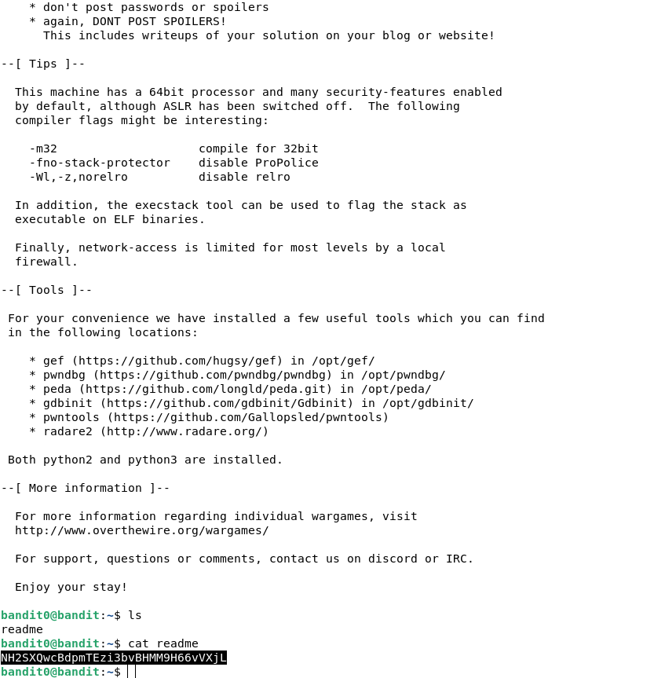
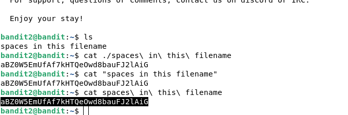

```shell
ssh bandit[0-9]@bandit.labs.overthewire.org -p 2220 # povezujem se sa hostom
```

## Level 0

```shell
ls  # gledam sadržaj kučnoj directorija root-a 
cat readme # izlazim sadržaj fajla readme
```


## Level 1

```shell
ls  # radim ls )
cat - # Ha, ha, ne radi zato što "-" koristi se kao stdin 
cat \- # pokušavam da izbegnem znak, ne radi
cat ./- # koristnim relativni put, ispalo je
cat "-" # isbegavam niz navodnicama, ne radi
```


## Level 2

```shell
ls #
cat ./spaces\ in\ this\ filename # izbegnem znakove razmaka, radi
cat "spaces in this filename" # takođe radi
cat spaces\ in\ this\ filename # takođe radi
```
``aBZ0W5EmUfAf7kHTQeOwd8bauFJ2lAiG``
