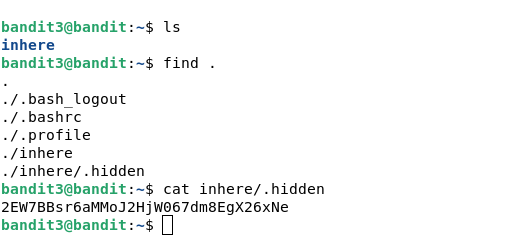
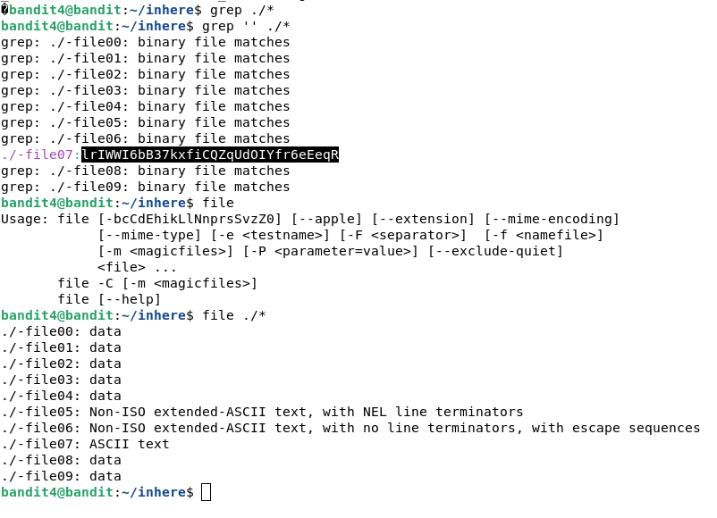
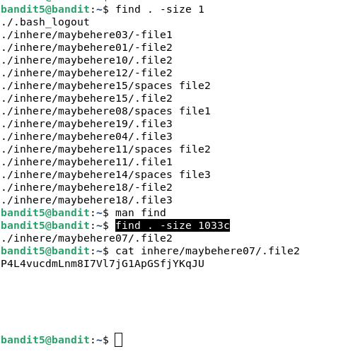
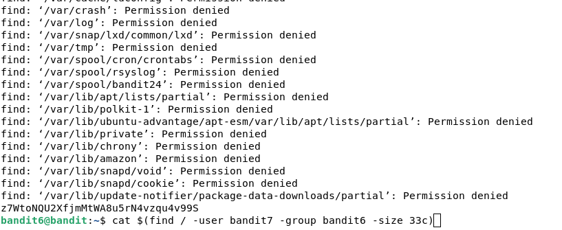
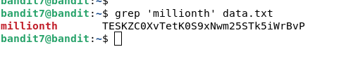
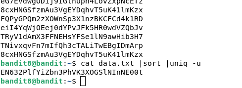
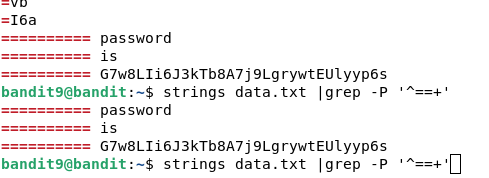
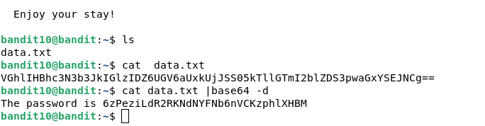

```shell
ssh bandit[0-9]@bandit.labs.overthewire.org -p 2220 # povezujem se sa hostom
```

## Level 0

```shell
ls  # gledam sadržaj kučnoj directorija root-a 
cat readme # izlazim sadržaj fajla readme
```


## Level 1

```shell
ls  # radim ls )
cat - # Ha, ha, ne radi zato što "-" koristi se kao stdin 
cat \- # pokušavam da izbegnem znak, ne radi
cat ./- # koristim relativni put, ispalo je
cat "-" # isbegavam red navodnicama, ne radi
```


## Level 2

```shell
ls #
cat ./spaces\ in\ this\ filename # izbegnem znakove razmaka, radi
cat "spaces in this filename" # takođe radi
cat spaces\ in\ this\ filename # takođe radi
```


## Level 3

```shell
ls # 
find . # pronalazim sve fajlovi
cat inhere/.hidden # kako lukavo )

ls -a # takođe koristna, ali ne treba
```

## Level 4


```shell
reset # treba posle izlaza binarna fajla u konsolu
grep '' ./* # grep radi
file ./* # takođe radi
```



## Level 5

```shell
find . -size 1 # pronalazim fajlovi velečine 1 blok
man find # čitam priručnik
find . -size 1033c # pronalazim fajlovi velečine 1033 bajt
cat inhere/maybehere07/.file2 # izlazim fajl
history # koristim za pisanje ove liste
```



## Level 6

```shell
cat $(find / -user bandit7 -group bandit6 -size 33c)
# radim u jednom redu pronalazim fajl i izlazim ga
```



## Level 7

```shell
grep 'millionth' data.txt # grep-am fajl
```



## Level 8

```shell
cat data.txt | sort | uniq  -u
# izlazim fajl, sortiram fajl(ovo je potrebno za komandu uniq), izlazim neponovljivi redove
```



## Level 9

```shell
strings data.txt | grep -P '^==+'
# izlazim sve redove iz fajla, filtriram redove početak sa 2+ znakov '='
```



## Level 10

```shell
cat data.txt | base64 -d # dekodiram base64-red
```

