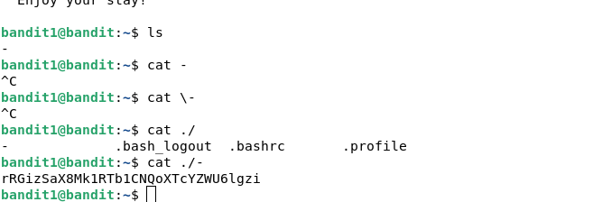

```shell
ssh bandit[0-9]@bandit.labs.overthewire.org -p 2220 #
```

## Level 0

```shell
ls  #
cat readme #
```


## Level 1

```shell
ls  #
cat - # Ha, ha. Classic
cat \- # try to escape character, not working
cat ./- # using relative path, get it
cat "-" # escaping with " also not working
```


## Level 2

```shell
ls
cat ./spaces\ in\ this\ filename #
cat "spaces in this filename" #
cat spaces\ in\ this\ filename #
```
``aBZ0W5EmUfAf7kHTQeOwd8bauFJ2lAiG``
