## Script badtest-1.sh

```shell
#!/bin/bash
# another example of how not to use the for command
for test in I don't know if this'll work
do
echo "word:$test"
done
```

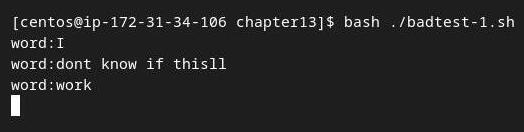
## Script badtest-2.sh

```shell
#!/bin/bash
# another example of how not to use the for command
for test in Nevada New Hampshire New Mexico New York North Carolina
do
echo "Now going to $test"
done
```

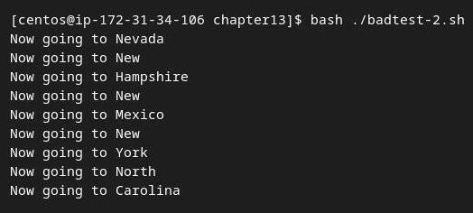
## Script badtest-3.sh

```shell
#!/bin/bash
# improperly using the continue command in a while loop
var1=0
while echo "while iteration: $var1"
[ $var1 -lt 15 ]
do
if [ $var1 -gt 5 ] && [ $var1 -lt 10 ]
then
continue
fi
echo " Inside iteration number: $var1"
var1=$[ $var1 + 1 ]
done
```

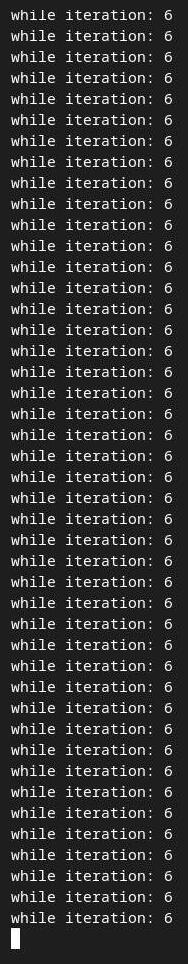
## Script test-01b.sh

```shell
#!/bin/bash

# testing the for variable after the looping
for test in Alabama Alaska Arizona Arkansas California Colorado
do
echo "The next state is $test"
done
echo "The last state we visited was $test"
test=Connecticut
echo "Wait, now we're visiting $test"
```

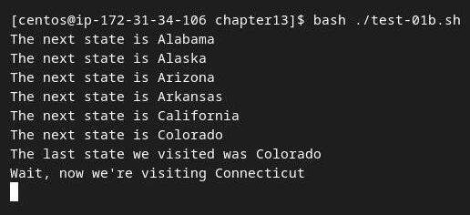
## Script test-01.sh

```shell
#!/bin/bash
# basic for command
for test in Alabama Alaska Arizona Arkansas California Colorado
do
echo The next state is $test
done
```

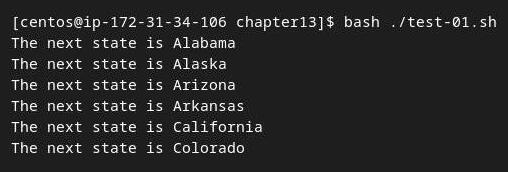
## Script test-02.sh

```shell
#!/bin/bash
# another example of how not to use the for command
for test in I don\'t know if "this'll" work
do
echo "word:$test"
done
```

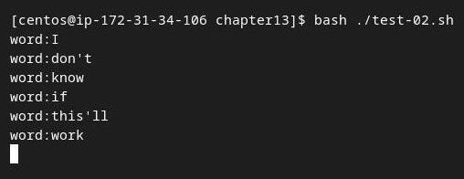
## Script test-03.sh

```shell
#!/bin/bash
# an example of how to properly define values
for test in Nevada "New Hampshire" "New Mexico" "New York"
do
echo "Now going to $test"
done
```

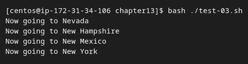
## Script test-04.sh

```shell
#!/bin/bash
# using a variable to hold the list
list="Alabama Alaska Arizona Arkansas Colorado"
list=$list" Connecticut"
for state in $list
do
echo "Have you ever visited $state?"
done
```

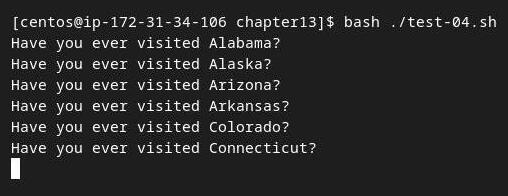
## Script test-05b.sh

```shell
#!/bin/bash
# reading values from a file
file="states"
IFS=$'\n'
for state in $(cat $file)
do
echo "Visit beautiful $state"
done
```

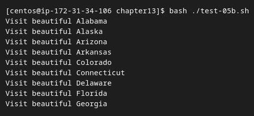
## Script test-05.sh

```shell
#!/bin/bash
# reading values from a file
file="states"
for state in $(cat $file)
do
echo "Visit beautiful $state"
done
```

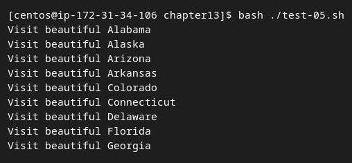
## Script test-06.sh

```shell
#!/bin/bash
# iterate through all the files in a directory
for file in /home/rich/test/*
do
if [ -d "$file" ]
then
echo "$file is a directory"
elif [ -f "$file" ]
then
echo "$file is a file"
fi
done
```

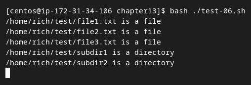
## Script test-07.sh

```shell
#!/bin/bash
# iterating through multiple directories
for file in /home/rich/.b* /home/rich/badtest
do
if [ -d "$file" ]
then
echo "$file is a directory"
elif [ -f "$file" ]
then
echo "$file is a file"
else
echo "$file doesn't exist"
fi
done
```

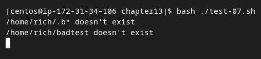
## Script test-08.sh

```shell
#!/bin/bash
# testing the C-style for loop
for (( i=1; i <= 10; i++ ))
do
echo "The next number is $i"
done
```

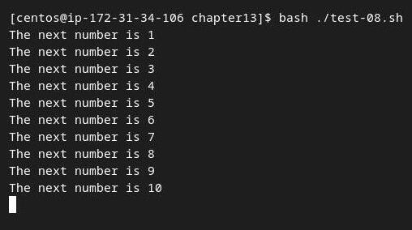
## Script test-09.sh

```shell
#!/bin/bash
# multiple variables
for (( a=1, b=10; a <= 10; a++, b-- ))
do
echo "$a - $b"
done
```

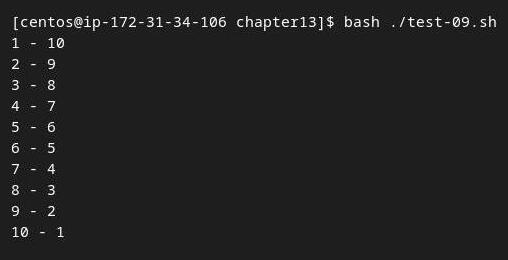
## Script test-10.sh

```shell
#!/bin/bash
# while command test
var1=10
while [ $var1 -gt 0 ]
do
echo $var1
var1=$[ $var1 - 1 ]
done
```

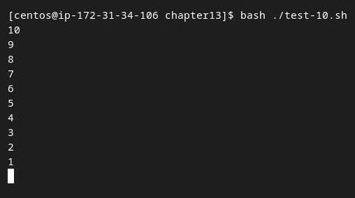
## Script test-11.sh

```shell
#!/bin/bash
# testing a multicommand while loop
var1=10
while echo $var1
[ $var1 -ge 0 ]
do
echo "This is inside the loop"
var1=$[ $var1 - 1 ]
done
```

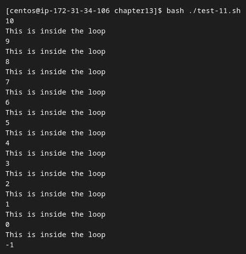
## Script test-12.sh

```shell
#!/bin/bash
# using the until command
var1=100
until [ $var1 -eq 0 ]
do
echo $var1
var1=$[ $var1 - 25 ]
done
```

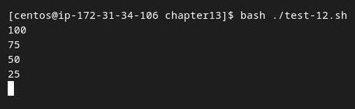
## Script test-13.sh

```shell
#!/bin/bash
# using the until command
var1=100
until echo $var1
[ $var1 -eq 0 ]
do
echo Inside the loop: $var1
var1=$[ $var1 - 25 ]
done
```

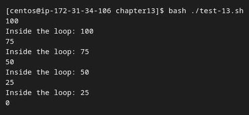
## Script test-14.sh

```shell
#!/bin/bash
# nesting for loops
for (( a = 1; a <= 3; a++ ))
do
echo "Starting loop $a:"
for (( b = 1; b <= 3; b++ ))
do
echo " Inside loop: $b"
done
done
```

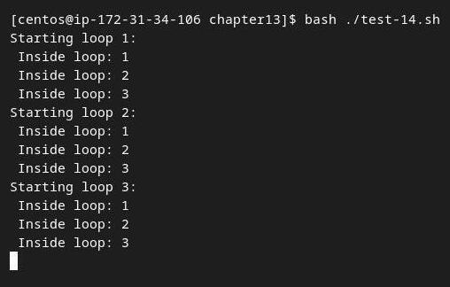
## Script test-15.sh

```shell
#!/bin/bash
# placing a for loop inside a while loop
var1=5
while [ $var1 -ge 0 ]
do
echo "Outer loop: $var1"
for (( var2 = 1; $var2 < 3; var2++ ))
do
var3=$[ $var1 * $var2 ]
echo " Inner loop: $var1 * $var2 = $var3"
done
var1=$[ $var1 - 1 ]
done
```

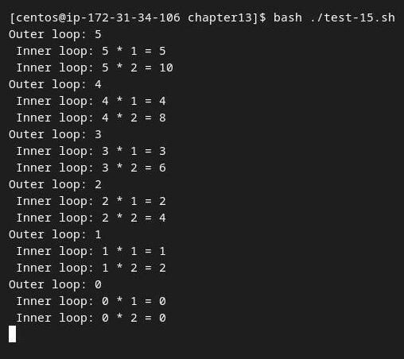
## Script test-16.sh

```shell
#!/bin/bash
# using until and while loops
var1=3
until [ $var1 -eq 0 ]
do
echo "Outer loop: $var1"
var2=1
while [ $var2 -lt 5 ]
do
var3=$(echo "scale=4; $var1 / $var2" | bc)
echo " Inner loop: $var1 / $var2 = $var3"
var2=$[ $var2 + 1 ]
done
var1=$[ $var1 - 1 ]
done
```

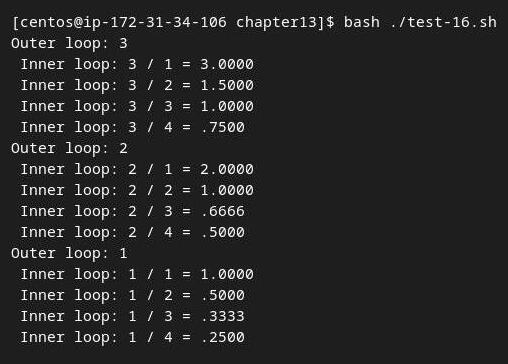
## Script test-17a.sh

```shell
#!/bin/bash
# changing the IFS value
IFS.OLD=$IFS
IFS=$'\n'
for entry in $(cat /etc/passwd)
do
echo "Values in $entry –"
IFS=:
for value in $entry
do
echo " $value"
done
done
```

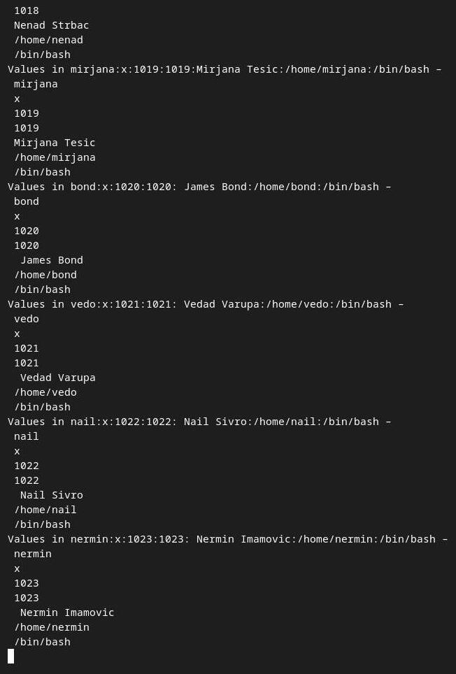
## Script test-17.sh

```shell
#!/bin/bash
# breaking out of a for loop
for var1 in 1 2 3 4 5 6 7 8 9 10
do
if [ $var1 -eq 5 ]
then
break
fi
echo "Iteration number: $var1"
done
echo "The for loop is completed"
```

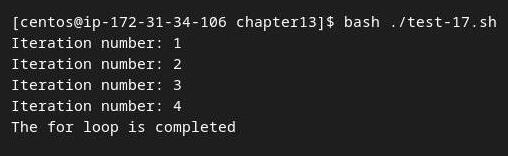
## Script test-18.sh

```shell
#!/bin/bash
# breaking out of a while loop
var1=1
while [ $var1 -lt 10 ]
do
if [ $var1 -eq 5 ]
then
break
fi
echo "Iteration: $var1"
var1=$[ $var1 + 1 ]
done
echo "The while loop is completed"
```

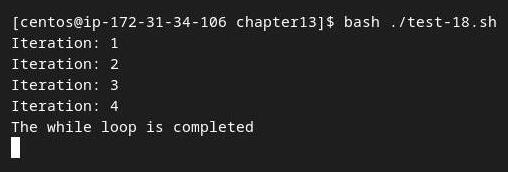
## Script test-19.sh

```shell
#!/bin/bash
# breaking out of an inner loop
for (( a = 1; a < 4; a++ ))
do
echo "Outer loop: $a"
for (( b = 1; b < 100; b++ ))
do
if [ $b -eq 5 ]
then
break
fi
echo " Inner loop: $b"
done
done
```

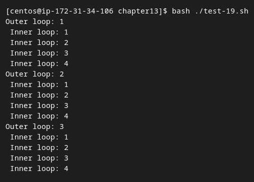
## Script test-20.sh

```shell
#!/bin/bash
# breaking out of an outer loop
for (( a = 1; a < 4; a++ ))
do
echo "Outer loop: $a"
for (( b = 1; b < 100; b++ ))
do
if [ $b -gt 4 ]
then
break 2
fi
echo " Inner loop: $b"
done
done
```

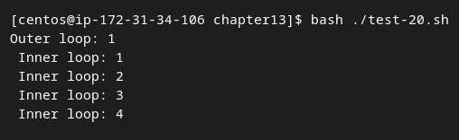
## Script test-21.sh

```shell
#!/bin/bash
# using the continue command
for (( var1 = 1; var1 < 15; var1++ ))
do
if [ $var1 -gt 5 ] && [ $var1 -lt 10 ]
then
continue
fi
echo "Iteration number: $var1"
done
```

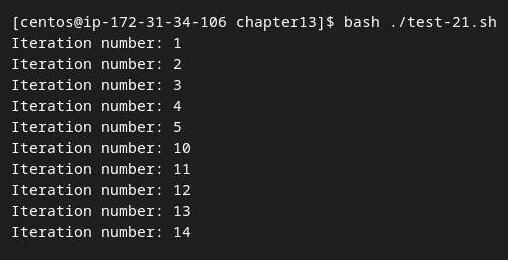
## Script test-22.sh

```shell
#!/bin/bash
# continuing an outer loop
for (( a = 1; a <= 5; a++ ))
do
echo "Iteration $a:"
for (( b = 1; b < 3; b++ ))
do
if [ $a -gt 2 ] && [ $a -lt 4 ]
then
continue 2
fi
var3=$[ $a * $b ]
echo " The result of $a * $b is $var3"
done
done
```

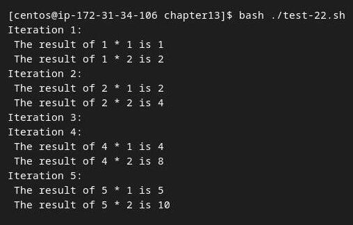
## Script test-23a.sh

```shell
#!/bin/bash
for file in /home/rich/*
do
if [ -d "$file" ]
then
echo "$file is a directory"
else #elif there was mistake
echo "$file is a file"
fi
done > output.txt

cat output.txt

```

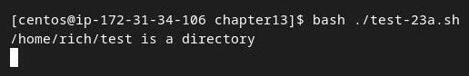
## Script test-23.sh

```shell
#!/bin/bash
# redirecting the for output to a file
for (( a = 1; a < 10; a++ ))
do
echo "The number is $a"
done > test23.txt
echo "The command is finished."

cat test23.txt
```

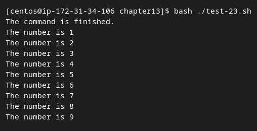
## Script test-24.sh

```shell
#!/bin/bash
# piping a loop to another command
for state in "North Dakota" Connecticut Illinois Alabama Tennessee
do
echo "$state is the next place to go"
done | sort
echo "This completes our travels"
```

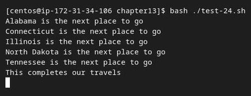
## Script test-25.sh

```shell
#!/bin/bash
# finding files in the PATH
IFS=:
for folder in $PATH
do
echo "$folder:"
for file in $folder/*
do
if [ -x $file ]
then
echo " $file"
fi
done
done
```

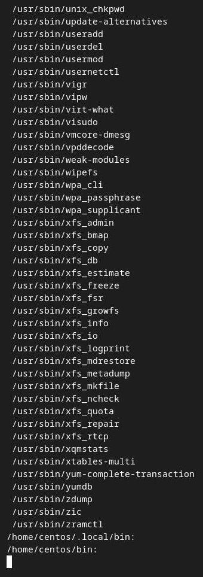
## Script test-26.sh

```shell
#!/bin/bash
# process new user accounts
input="users.csv"
while IFS=',' read -r userid name
do
echo "adding $userid"
useradd -c "$name" -m $userid
done < "$input"

tail /etc/passwd
```

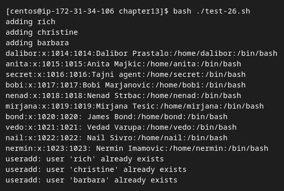
