## Script test-1.sh

```shell
#!/bin/bash
# using one command line parameter
#
factorial=1
for (( number = 1; number <= $1 ; number++ ))
do
factorial=$[ $factorial * $number ]
done
echo The factorial of $1 is $factorial
```

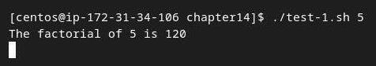
## Script test-2.sh

```shell
#!/bin/bash
# testing two command line parameters
#
total=$[ $1 * $2 ]
echo The first parameter is $1.
echo The second parameter is $2.
echo The total value is $total.
```

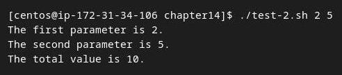
## Script test-3.sh

```shell
#!/bin/bash
# testing string parameters
#
echo Hello $1, glad to meet you.
```

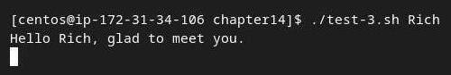

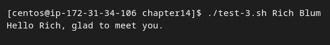

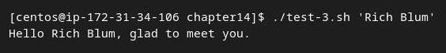

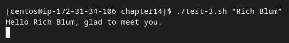
## Script test-4.sh

```shell
#!/bin/bash
# handling lots of parameters
#
total=$[ ${10} * ${11} ]
echo The tenth parameter is ${10}
echo The eleventh parameter is ${11}
echo The total is $total
```

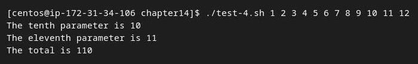
## Script test-5.sh

```shell
#!/bin/bash
# Testing the $0 parameter
#
echo The zero parameter is set to: $0
#
```

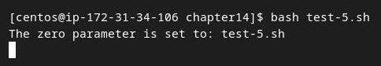

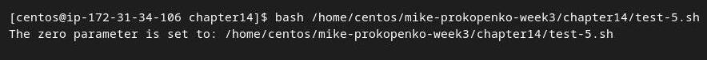
## Script test-5b.sh

```shell
#!/bin/bash
# Using basename with the $0 parameter
#
name=$(basename $0)
echo
echo The script name is: $name
#
```

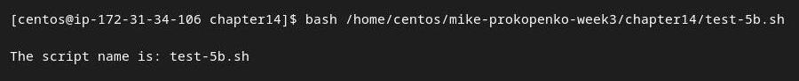

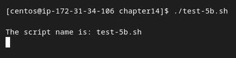
## Script test-6.sh

```shell
#!/bin/bash
# Testing a Multi-function script
#
name=$(basename $0)
#
if [ $name = "addem" ]
then
total=$[ $1 + $2 ]
#
elif [ $name = "multem" ]
then
total=$[ $1 * $2 ]
fi
#
echo
echo The calculated value is $total
```

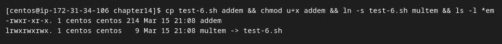

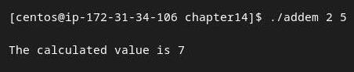

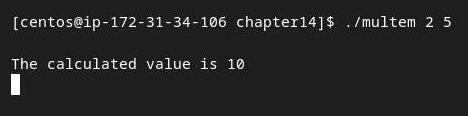
## Script test-7.sh

```shell
#!/bin/bash
# testing parameters before use
#
if [ -n "$1" ]
then
echo Hello $1, glad to meet you.
else
echo "Sorry, you did not identify yourself. "
fi
```

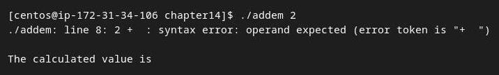


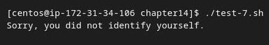
## Script test-8.sh

```shell
#!/bin/bash
# getting the number of parameters
#
echo There were $# parameters supplied.
```

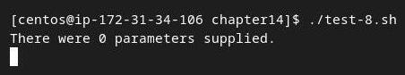

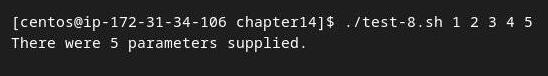

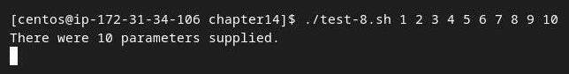

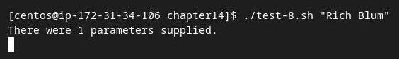
## Script test-9.sh

```shell
#!/bin/bash
# Testing parameters
#
if [ $# -ne 2 ]
then
echo
echo Usage: test9.sh a b
echo
else
total=$[ $1 + $2 ]
echo
echo The total is $total
echo
fi
```

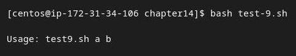

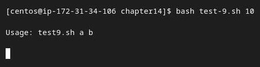

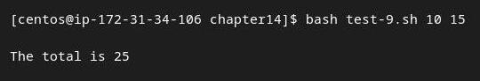
## Script badtest-1.sh

```shell
#!/bin/bash
# testing grabbing last parameter
#
echo The last parameter was ${$#}
```

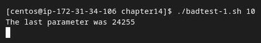
## Script test-10.sh

```shell
#!/bin/bash
# Grabbing the last parameter
#
params=$#
echo
echo The last parameter is $params
echo The last parameter is ${!#}
echo
```

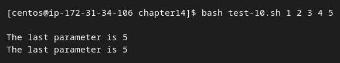

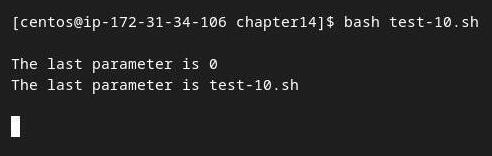
## Script test-11.sh

```shell
#!/bin/bash
# testing $* and $@
#
echo
echo "Using the \$* method: $*"
echo
echo "Using the \$@ method: $@"
```

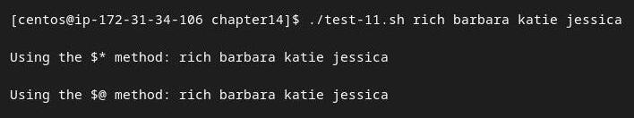
## Script test-12.sh

```shell
#!/bin/bash
# testing $* and $@
#
echo
count=1
#
for param in "$*"
do
echo "\$* Parameter #$count = $param"
count=$[ $count + 1 ]
done
#
echo
count=1
#
for param in "$@"
do
echo "\$@ Parameter #$count = $param"
count=$[ $count + 1 ]
done
```

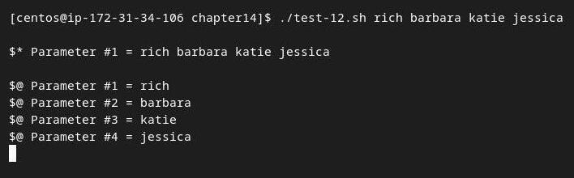
## Script test-13.sh

```shell
#!/bin/bash
# demonstrating the shift command
echo
count=1
while [ -n "$1" ]
do
echo "Parameter #$count = $1"
count=$[ $count + 1 ]
shift
done
```

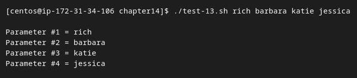
## Script test-14.sh

```shell
#!/bin/bash
# demonstrating a multi-position shift
#
echo
echo "The original parameters: $*"
shift 2
echo "Here's the new first parameter: $1"
```

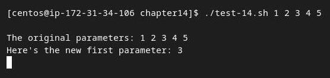
## Script test-15.sh

```shell
#!/bin/bash
# extracting command line options as parameters
#
echo
while [ -n "$1" ]
do
case "$1" in
-a) echo "Found the -a option" ;;
-b) echo "Found the -b option" ;;
-c) echo "Found the -c option" ;;
*) echo "$1 is not an option" ;;
esac
shift
done
```

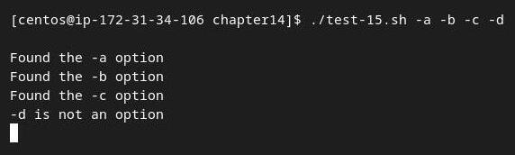

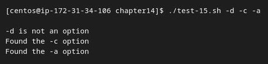
## Script test-16.sh

```shell
#!/bin/bash
# extracting options and parameters
echo
while [ -n "$1" ]
do
case "$1" in
-a) echo "Found the -a option" ;;
-b) echo "Found the -b option";;
-c) echo "Found the -c option" ;;
--) shift
break ;;
*) echo "$1 is not an option";;
esac
shift
done
#
count=1
for param in $@
do
echo "Parameter #$count: $param"
count=$[ $count + 1 ]
done
```

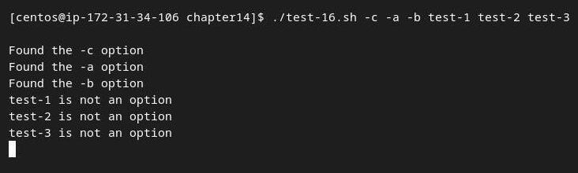

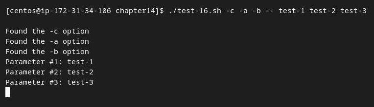
## Script test-17.sh

```shell
#!/bin/bash
# extracting command line options and values
echo
while [ -n "$1" ]
do
  case "$1" in
    -a) echo "Found the -a option";;
    -b) param="$2"
    echo "Found the -b option, with parameter value $param"
    shift ;;
    -c) echo "Found the -c option";;
    --) shift
    break ;;
    *) echo "$1 is not an option";;
  esac
  shift
done
#
count=1
for param in "$@"
do
echo "Parameter #$count: $param"
count=$[ $count + 1 ]
done
```

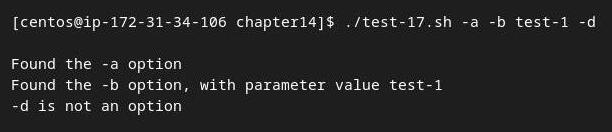

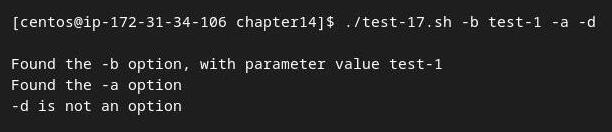

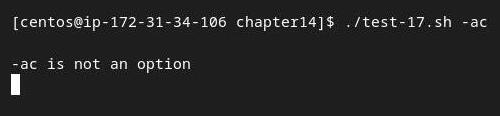
## Script test-18.sh

```shell
#!/bin/bash
# Extract command line options & values with getopt
#
set -- $(getopt -q ab:cd "$@")
#
echo
while [ -n "$1" ]
do
case "$1" in
-a) echo "Found the -a option" ;;
-b) param="$2"
echo "Found the -b option, with parameter value $param"
shift ;;
-c) echo "Found the -c option" ;;
--) shift
break ;;
*) echo "$1 is not an option";;
esac
shift
done
#
count=1
for param in "$@"
do
echo "Parameter #$count: $param"
count=$[ $count + 1 ]
done
#
```

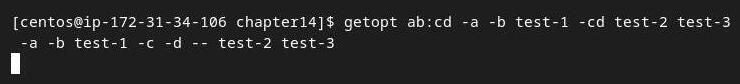

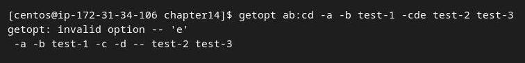

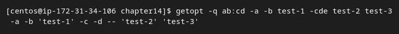

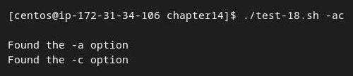

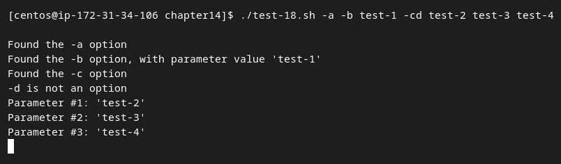

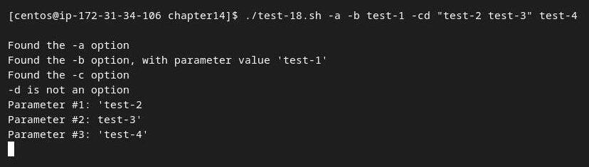
## Script test-19.sh

```shell
#!/bin/bash
# simple demonstration of the getopts command
#
echo
while getopts :ab:c opt
do
case "$opt" in
a) echo "Found the -a option" ;;
b) echo "Found the -b option, with value $OPTARG";;
c) echo "Found the -c option" ;;
*) echo "Unknown option: $opt";;
esac
done

```

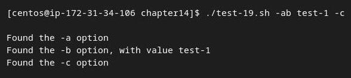

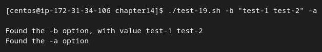

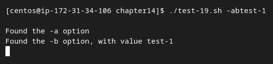

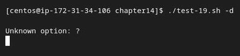

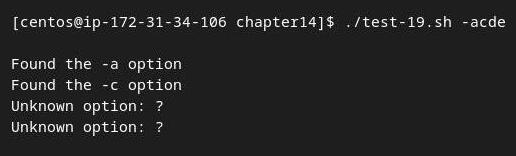
## Script test-20.sh

```shell
#!/bin/bash
# Processing options & parameters with getopts
#
echo
while getopts :ab:cd opt
do
case "$opt" in
a) echo "Found the -a option" ;;
b) echo "Found the -b option, with value $OPTARG" ;;
c) echo "Found the -c option" ;;
d) echo "Found the -d option" ;;
*) echo "Unknown option: $opt" ;;
esac
done
#
shift $[ $OPTIND - 1 ]
#
echo
count=1
for param in "$@"
do
echo "Parameter $count: $param"
count=$[ $count + 1 ]
done
```

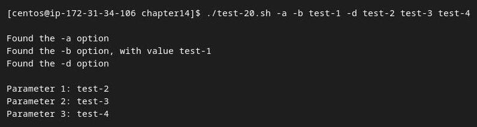
## Script test-21.sh

```shell
#!/bin/bash
# testing the read command
#
echo -n "Enter your name: "
read name
echo "Hello $name, welcome to my program. "
#
```

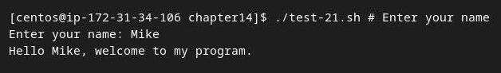
## Script test-22.sh

```shell
#!/bin/bash
# testing the read -p option
#
read -p "Please enter your age: " age
days=$[ $age * 365 ]
echo "That makes you over $days days old! "
#
```


## Script test-23.sh

```shell
#!/bin/bash
# entering multiple variables
#
read -p "Enter your name: " first last
echo "Checking data for $last, $first..."
```


## Script test-24.sh

```shell
#!/bin/bash
# Testing the REPLY Environment variable
#
read -p "Enter your name: "
echo
echo Hello $REPLY, welcome to my program.

```


## Script test-25.sh

```shell
#!/bin/bash
# timing the data entry
#
if read -t 5 -p "Please enter your name: " name
then
echo "Hello $name, welcome to my script"
else
echo
echo "Sorry, too slow! "
fi
```


## Script test-26.sh

```shell
#!/bin/bash
# getting just one character of input
#
read -n1 -p "Do you want to continue [Y/N]? " answer
case $answer in
Y | y) echo
echo "fine, continue on...";;
N | n) echo
echo OK, goodbye
exit;;
esac
echo "This is the end of the script"
```


## Script test-27.sh

```shell
#!/bin/bash
# hiding input data from the monitor
#
read -s -p "Enter your password: " pass
echo
echo "Is your password really $pass? "

```


## Script test-28.sh

```shell
#!/bin/bash
# reading data from a file
#
count=1
cat test | while read line
do
echo "Line $count: $line"
count=$[ $count + 1]
done
echo "Finished processing the file"

```


