## Script test-1.sh

```shell
#!/bin/bash
# Understanding of streams
```

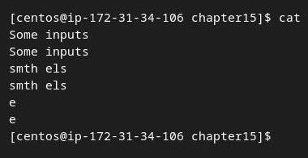

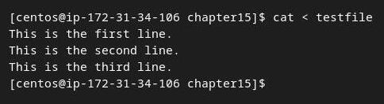

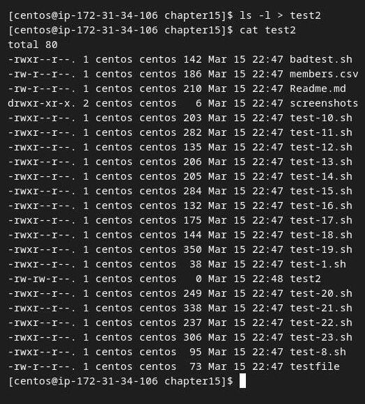

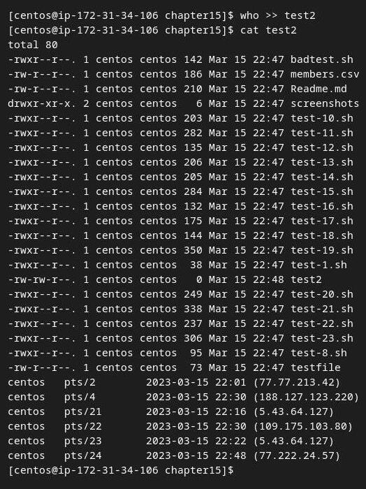

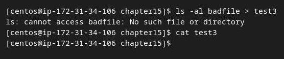

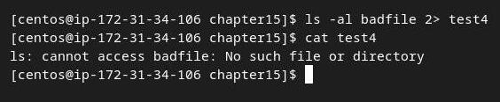

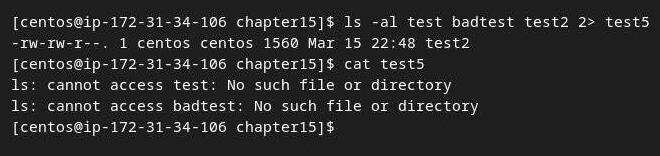

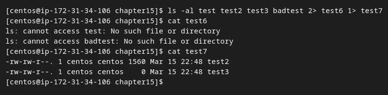

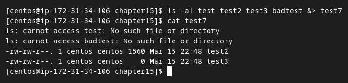
## Script test-8.sh

```shell
#!/bin/bash
# testing STDERR messages
echo "This is an error" >&2
echo "This is normal output"

```

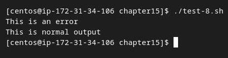

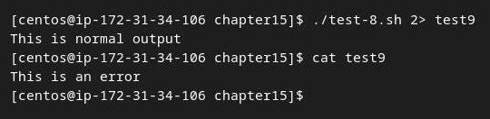
## Script test-10.sh

```shell
#!/bin/bash
# redirecting all output to a file
exec 1>testout
echo "This is a test of redirecting all output"
echo "from a script to another file."
echo "without having to redirect every individual line"
```

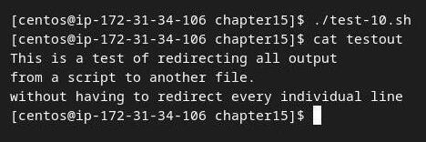
## Script test-11.sh

```shell
#!/bin/bash
# redirecting output to different locations
exec 2>testerror
echo "This is the start of the script"
echo "now redirecting all output to another location"
exec 1>testout
echo "This output should go to the testout file"
echo "but this should go to the testerror file" >&2

```

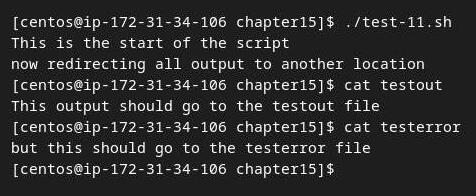
## Script test-12.sh

```shell
#!/bin/bash
# redirecting file input
exec 0< testfile
count=1
while read line
do
echo "Line #$count: $line"
count=$[ $count + 1 ]
done

```

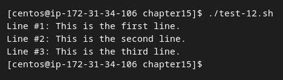
## Script test-13.sh

```shell
#!/bin/bash
# using an alternative file descriptor
exec 3>test13out
echo "This should display on the monitor"
echo "and this should be stored in the file" >&3
echo "Then this should be back on the monitor"

```

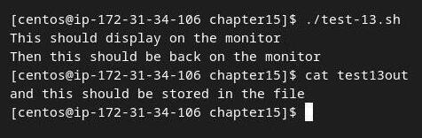
## Script test-14.sh

```shell
#!/bin/bash
# storing STDOUT, then coming back to it
exec 3>&1
exec 1>test14out
echo "This should store in the output file"
echo "along with this line."
exec 1>&3
echo "Now things should be back to normal"
```

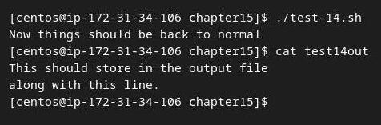
## Script test-15.sh

```shell
#!/bin/bash
# redirecting input file descriptors
exec 6<&0
exec 0< testfile
count=1
while read line
do
echo "Line #$count: $line"
count=$[ $count + 1 ]
done
exec 0<&6
read -p "Are you done now? " answer
case $answer in
Y|y) echo "Goodbye";;
N|n) echo "Sorry, this is the end.";;
esac

```

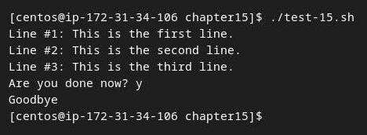
## Script test-16.sh

```shell
#!/bin/bash
# testing input/output file descriptor
exec 3<> testfile
read line <&3
echo "Read: $line"
echo "This is a test line" >&3
```

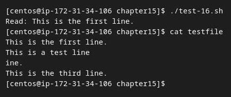
## Script badtest.sh

```shell
#!/bin/bash
# testing closing file descriptors
exec 3> test17file
echo "This is a test line of data" >&3
exec 3>&-
echo "This won't work" >&3

```

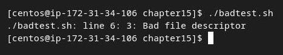
## Script test-17.sh

```shell
#!/bin/bash
# testing closing file descriptors
exec 3> test17file
echo "This is a test line of data" >&3
exec 3>&-
cat test17file
exec 3> test17file
echo "This'll be bad" >&3

```

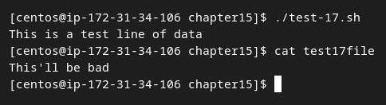
## Script test-18.sh

```shell
#!/bin/bash
# testing lsof with file descriptors
exec 3> test18file1
exec 6> test18file2
exec 7< testfile
/usr/sbin/lsof -a -p $$ -d0,1,2,3,6,7

```

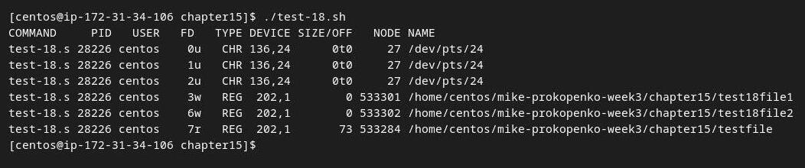
## Script test-19.sh

```shell
#!/bin/bash
# creating and using a temp file
tempfile=$(mktemp test19.XXXXXX)
exec 3>$tempfile
echo "This script writes to temp file $tempfile"
echo "This is the first line" >&3
echo "This is the second line." >&3
echo "This is the last line." >&3
exec 3>&-
echo "Done creating temp file. The contents are:"
cat $tempfile
rm -f $tempfile 2> /dev/null
```

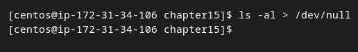

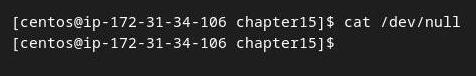

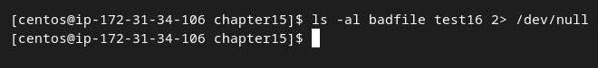

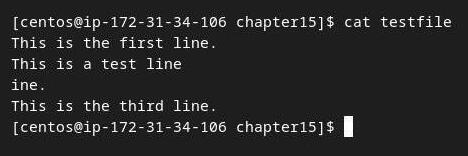

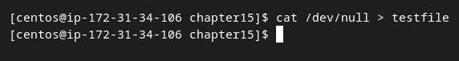

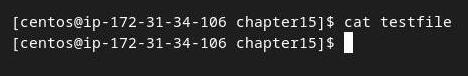

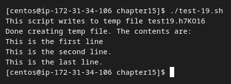
## Script test-20.sh

```shell
#!/bin/bash
# creating a temp file in /tmp
tempfile=$(mktemp -t tmp.XXXXXX)
echo "This is a test file." > $tempfile
echo "This is the second line of the test." >> $tempfile
echo "The temp file is located at: $tempfile"
cat $tempfile
rm -f $tempfile

```

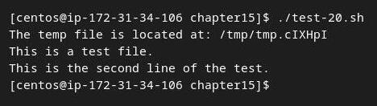
## Script test-21.sh

```shell
#!/bin/bash
# using a temporary directory
tempdir=$(mktemp -d dir.XXXXXX)
cd $tempdir
tempfile1=$(mktemp temp.XXXXXX)
tempfile2=$(mktemp temp.XXXXXX)
exec 7> $tempfile1
exec 8> $tempfile2
echo "Sending data to directory $tempdir"
echo "This is a test line of data for $tempfile1" >&7
echo "This is a test line of data for $tempfile2" >&8

```

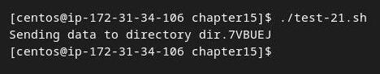
## Script test-22.sh

```shell
#!/bin/bash
# using the tee command for logging
tempfile=test22file
echo "This is the start of the test" | tee $tempfile
echo "This is the second line of the test" | tee -a $tempfile
echo "This is the end of the test" | tee -a $tempfile

```

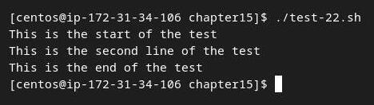
## Script test-23.sh

```shell
#!/bin/bash
# read file and create INSERT statements for MySQL
outfile='members.sql'
IFS=','
while read lname fname address city state zip
do
cat >> $outfile << EOF
INSERT INTO members (lname,fname,address,city,state,zip) VALUES
('$lname', '$fname', '$address', '$city', '$state', '$zip');
EOF
done < ${1}

```

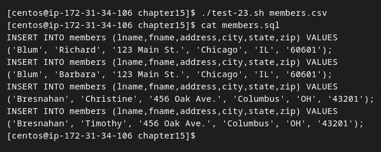
