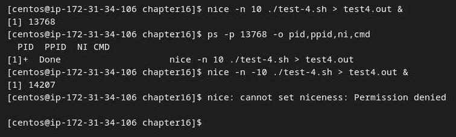

## Script test-1.sh 

```shell 
#!/bin/bash
# Testing signal trapping
#
trap "echo ' Sorry! I have trapped Ctrl-C'" SIGINT
#
echo This is a test script
#
count=1
while [ $count -le 10 ]
do
echo "Loop #$count"
sleep 1
count=$[ $count + 1 ]
done
#
echo "This is the end of the test script"
#
```


## Script test-2.sh

```shell
#!/bin/bash
# Trapping the script exit
#
trap "echo Goodbye..." EXIT
#
count=1
while [ $count -le 5 ]
do
echo "Loop #$count"
sleep 1
count=$[ $count + 1 ]
done
#

```


## Script test-3.sh

```shell
#!/bin/bash
# Modifying a set trap
#
trap "echo ' Sorry... Ctrl-C is trapped.'" SIGINT
#
count=1
while [ $count -le 5 ]
do
echo "Loop #$count"
sleep 1
count=$[ $count + 1 ]
done
#
trap "echo ' I modified the trap!'" SIGINT
#
count=1
while [ $count -le 5 ]
do
echo "Second Loop #$count"
sleep 1
count=$[ $count + 1 ]
done
#
```


## Script test-3b.sh

```shell
#!/bin/bash
# Removing a set trap
#
trap "echo ' Sorry... Ctrl-C is trapped.'" SIGINT
#
count=1
while [ $count -le 5 ]
do
echo "Loop #$count"
sleep 1
count=$[ $count + 1 ]
done
#
# Remove the trap
trap -- SIGINT
echo "I just removed the trap"
#
count=1
while [ $count -le 5 ]
do
echo "Second Loop #$count"
sleep 1
count=$[ $count + 1 ]
done
#
```


## Script test-4.sh

```shell
#!/bin/bash
# Test running in the background
#
count=1
while [ $count -le 10 ]
do
sleep 1
count=$[ $count + 1 ]
done
#
```


## Script test-5.sh

```shell
#!/bin/bash
# Test running in the background with output
#
echo "Start the test script"
count=1
while [ $count -le 5 ]
do
echo "Loop #$count"
sleep 5
count=$[ $count + 1 ]
done
#
echo "Test script is complete"
#

```


## Script test-[6-9].sh

```shell
#!/bin/bash
#
echo This is a test script
sleep 1m
```


## nohup test-1.sh


## Script 

```shell
#!/bin/bash
# Test job control
#
echo "Script Process ID: $$"
#
count=1
while [ $count -le 10 ]
do
echo "Loop #$count"
sleep 10
count=$[ $count + 1 ]
done
#
echo "End of script..."
#
```


## Jobs


## Nice 




## Script test-13.sh

```shell
#!/bin/bash
# Test using at command
#
echo "This script ran at $(date +%B%d,%T)"
echo
sleep 5
echo "This is the script's end..."
#
```


## Script test-13b.sh

```shell
#!/bin/bash
# Test using at command
#
echo "This script ran at $(date +%B%d,%T)" > test13b.out
echo >> test13b.out
sleep 5
echo "This is the script's end..." >> test13b.out
#
```


## Cron


